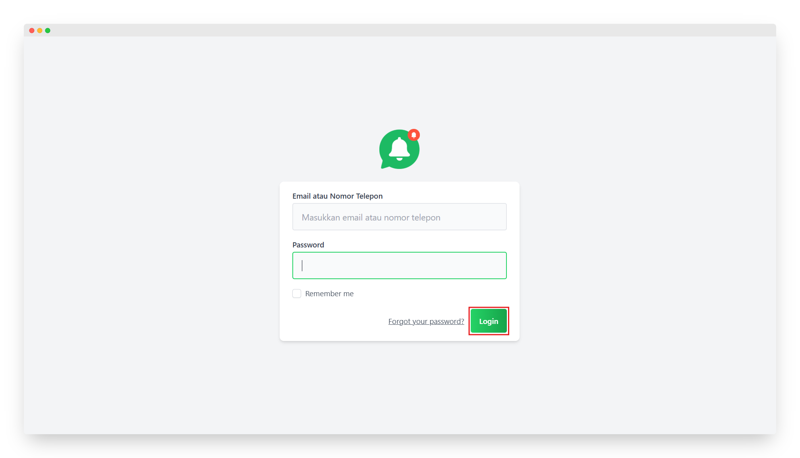
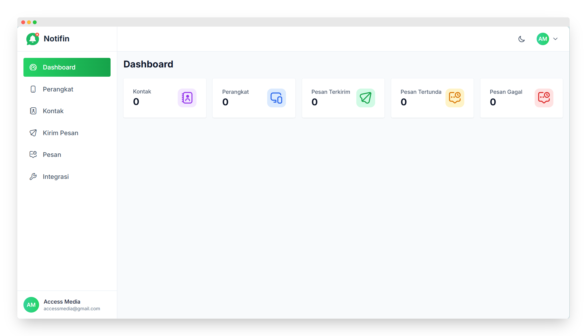

# Dashboard

Panduan ini menjelaskan langkah-langkah untuk menggunakan menu **Dashboard** di aplikasi **Notifin**.

---

## 🔐 Login ke Aplikasi

- Buka aplikasi **Notifin** melalui tautan resmi yang sudah disediakan.  
- Masukkan *Email* dan *Password* akun kamu.  
- Klik tombol **Login** untuk melanjutkan.  
- Setelah berhasil login, kamu akan diarahkan ke halaman utama yaitu **Dashboard**.

---

## 🧭 Tampilan Utama

Dashboard menampilkan beberapa kartu informasi berikut:

- **Kontak** → Jumlah total kontak yang tersimpan di aplikasi.  
- **Perangkat** → Jumlah perangkat WhatsApp yang sudah terhubung dan aktif.  
- **Pesan Terkirim** → Jumlah pesan WhatsApp yang sudah berhasil dikirim.  
- **Pesan Tertunda** → Jumlah pesan yang sedang menunggu antrian pengiriman.  
- **Pesan Gagal** → Jumlah pesan yang gagal dikirim ke penerima.

---

## 🧩 Menu yang Tersedia di Sidebar

Pada bagian kiri tampilan aplikasi, terdapat menu utama:

- **Dashboard** → Ringkasan seluruh data dan aktivitas.
- **Perangkat** → Menambahkan atau mengelola perangkat WhatsApp yang digunakan untuk mengirim pesan.
- **Kontak** → Menyimpan dan mengatur daftar kontak penerima pesan.
- **Kirim Pesan** → Tempat untuk mengirim pesan baru ke nomor atau grup.
- **Pesan** → Melihat riwayat pesan yang sudah terkirim, tertunda, atau gagal.
- **Integrasi** → Menghubungkan Notifin dengan sistem lain seperti API atau aplikasi pihak ketiga.

---

✅ **Selesai!** Tampilan **Dashboard** berhasil dijelaskan dan siap digunakan oleh Admin untuk memantau seluruh aktivitas di aplikasi **Notifin** 🎉

