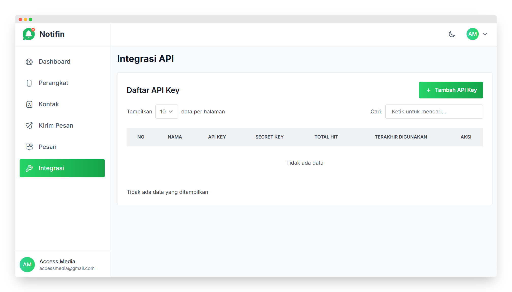
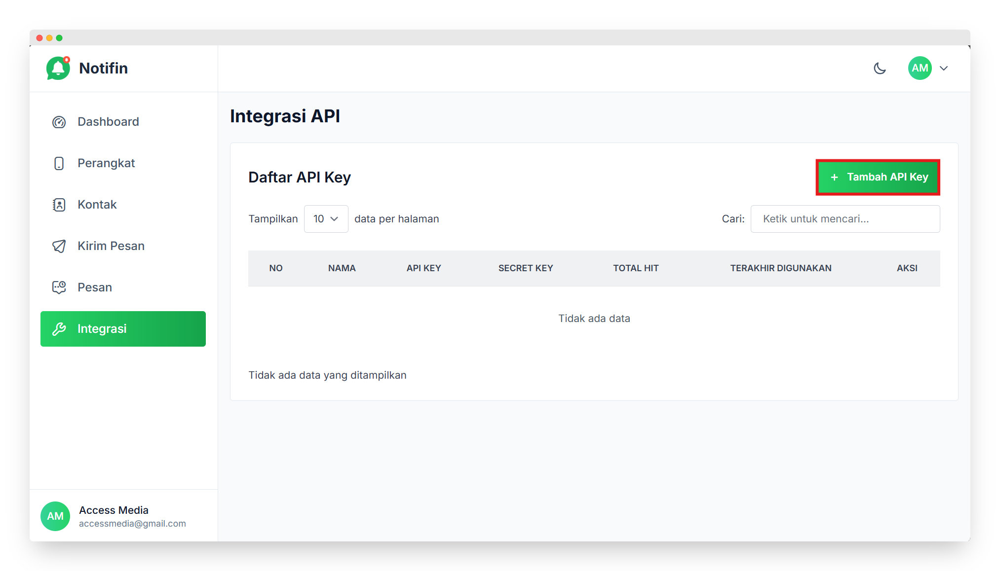
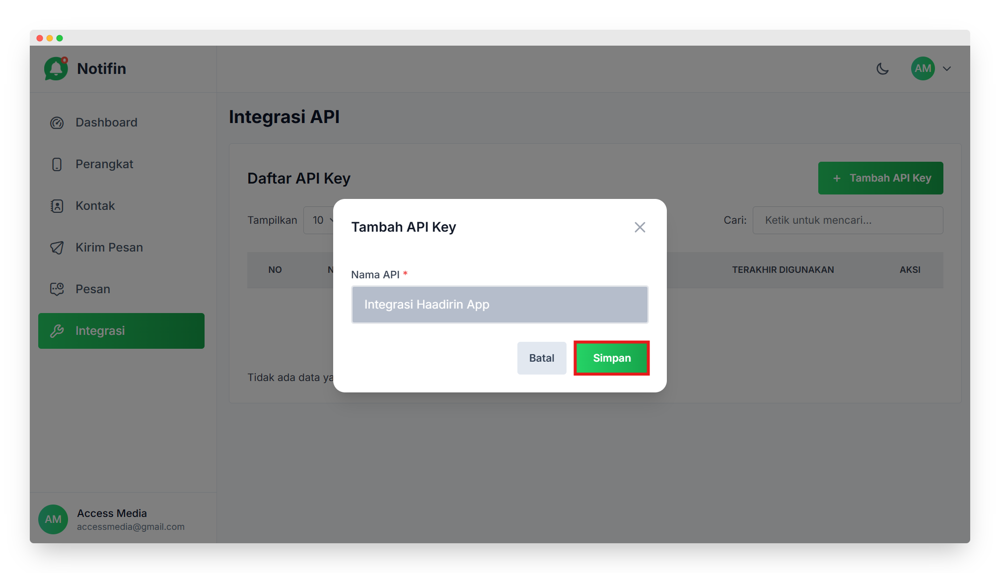
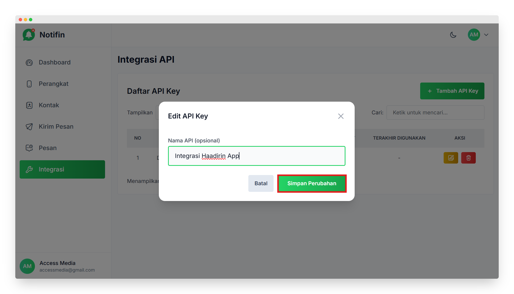
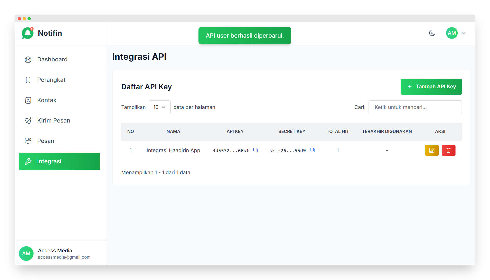
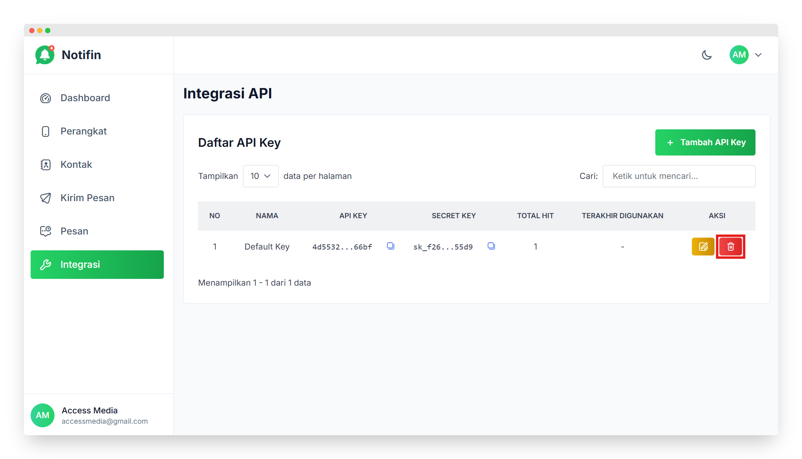
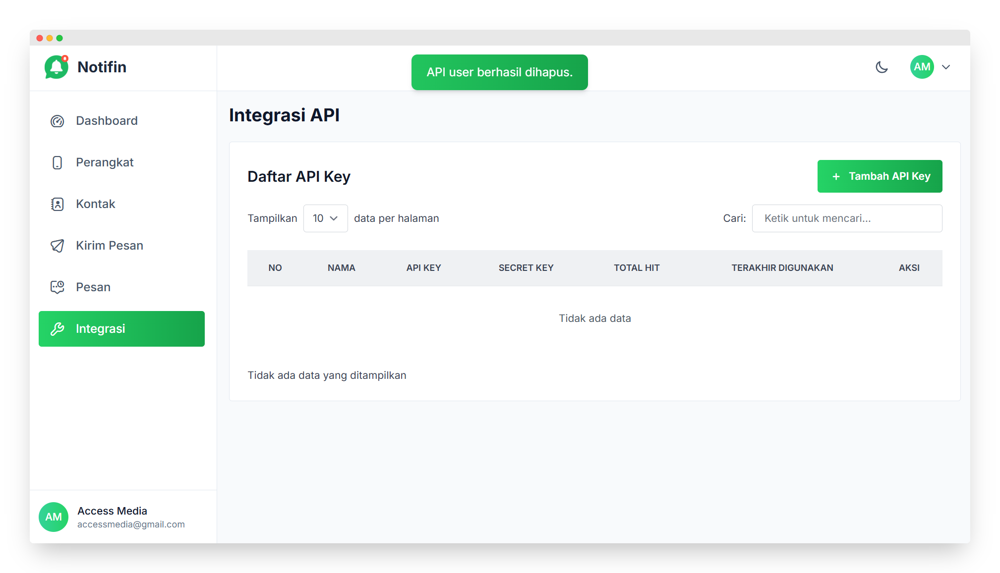
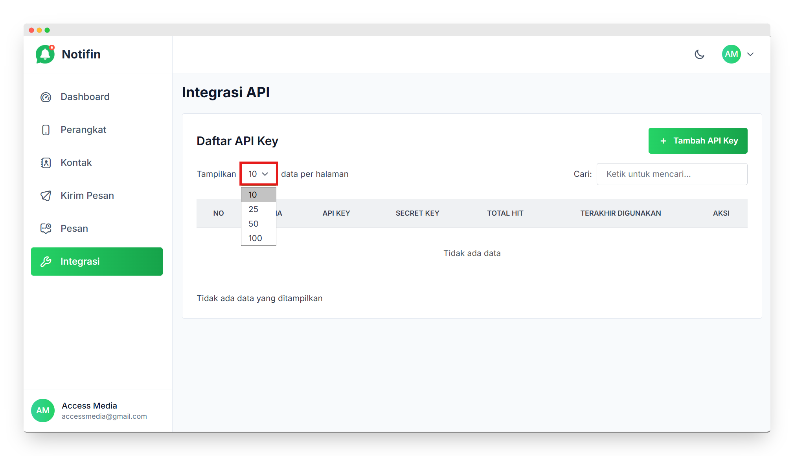
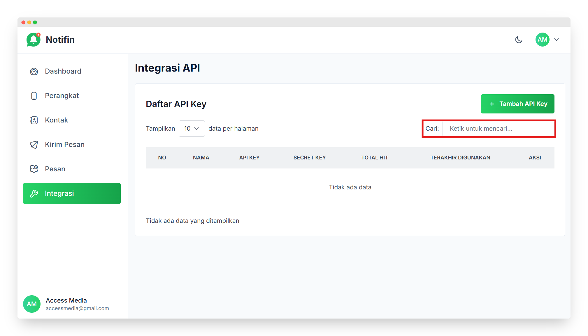

# Integrasi

Panduan ini menjelaskan langkah-langkah untuk menggunakan menu **Integrasi** di aplikasi **Notifin**.

---

## Masuk ke Menu Integrasi

- Di *sidebar* sebelah kiri, pilih menu **Integrasi**.  
- Halaman ini digunakan untuk mengelola **kunci API (API Key)**, yaitu kode unik yang berfungsi menghubungkan aplikasi **Notifin** dengan aplikasi lain secara otomatis dan aman.

---

## Daftar API Key

Pada halaman ini dapat dilihat daftar API Key yang sudah dibuat, meliputi:

- **No** → nomor urut data API Key.  
- **Nama** → nama identifikasi dari API Key.   
- **API Key** → kode unik utama yang digunakan sebagai kunci akses sistem.  
- **Secret Key** → kunci rahasia tambahan untuk keamanan.  
- **Total Hit** → jumlah permintaan (request) yang telah dilakukan menggunakan API tersebut.  
- **Terakhir Digunakan** → waktu terakhir API Key tersebut digunakan.  
- **Aksi** → digunakan untuk mengedit atau menghapus API Key.

---

## Menambahkan API Key Baru

- Klik tombol **Tambah API Key** di pojok kanan atas.  
- Isi nama untuk API Key baru, lalu simpan.  

- Setelah disimpan, sistem akan otomatis membuat **API Key** dan **Secret Key** baru yang bisa digunakan untuk menghubungkan aplikasi lain dengan **Notifin**.

---

## Mengedit API Key

- Klik ikon **Edit** pada kolom **Aksi** di baris API Key yang ingin diperbarui.

- Lakukan perubahan pada kolom **Nama** atau pengaturan lain yang tersedia.  
- Tekan tombol **Simpan** untuk menyimpan perubahan.  

- Setelah disimpan, data API Key akan diperbarui tanpa mengubah kode **API Key** maupun **Secret Key** yang sudah ada.

---

## Menghapus API Key

- Klik ikon **Hapus** pada kolom **Aksi** di baris API Key yang ingin dihapus.  

- Akan muncul jendela konfirmasi penghapusan.  
- Tekan **Ya, Hapus** untuk menghapus API Key secara permanen.  

- Setelah dihapus, koneksi aplikasi lain yang menggunakan kunci tersebut akan otomatis berhenti.

---

## Tampilkan Data

Fitur **Tampilkan Data** memungkinkan pengguna menentukan jumlah baris yang ditampilkan pada tabel integrasi.

Pilihan yang tersedia:

> - 10 data per halaman  
> - 25 data per halaman  
> - 50 data per halaman  
> - 100 data per halaman  

> Fitur ini membantu menyesuaikan tampilan agar lebih nyaman saat melihat daftar API Key dalam jumlah besar.

---

## Cari API Key

Kolom **Cari** berfungsi untuk menemukan API Key tertentu secara cepat tanpa harus menggulir daftar.

Pengguna dapat mencari berdasarkan:

> - Nama tujuan  
> - API Key  
> - Secret Key  

> Cukup ketik kata kunci di kolom pencarian, sistem akan otomatis menampilkan hasil yang sesuai.

---

## Catatan

> - Simpan **API Key** dan **Secret Key** dengan aman, jangan dibagikan ke pihak lain.  
> - API Key berfungsi seperti **kunci akses** untuk sistem lain agar dapat berkomunikasi dengan aplikasi Notifin.  
> - Jika kunci ini terhapus atau diubah, koneksi ke aplikasi lain akan berhenti.

---

✅ **Selesai!** Panduan penggunaan menu **Integrasi API** di aplikasi **Notifin** telah berhasil dipahami 🎉
