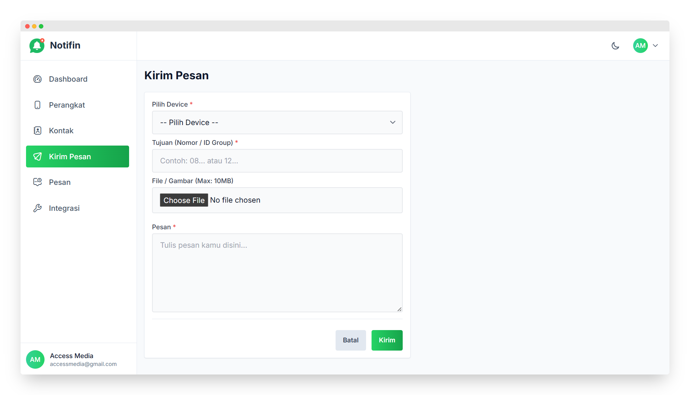
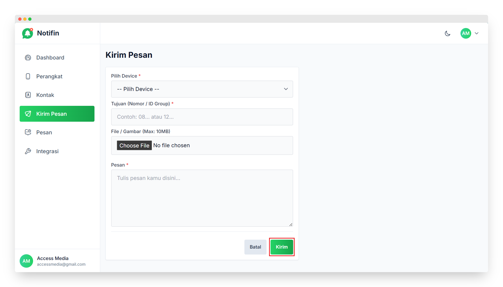

# Kirim Pesan

Panduan ini menjelaskan langkah-langkah untuk menggunakan menu **Kirim Pesan** di aplikasi **Notifin**.

---

## Masuk ke Menu Kirim Pesan

- Di *sidebar* sebelah kiri, pilih menu **Kirim Pesan**.  
- Halaman ini digunakan untuk mengirim pesan WhatsApp ke nomor atau grup tertentu menggunakan perangkat yang sudah terhubung.

---

## Mengisi Form Kirim Pesan

Pada halaman Kirim Pesan, terdapat beberapa kolom yang harus diisi:

1. **Pilih Device**  
   - Pilih perangkat WhatsApp yang sudah terhubung untuk mengirim pesan.  
   - Jika belum ada device yang aktif, pastikan menambahkan atau menghubungkan perangkat terlebih dahulu melalui menu **Perangkat**.  

2. **Tujuan (Nomor / ID Group)**  
   - Isi dengan nomor WhatsApp tujuan (contoh: *08...* atau *62...*)  
   - Bisa juga memasukkan **ID Group** jika ingin mengirim pesan ke grup WhatsApp.  

3. **File / Gambar (Max: 10MB)**  
   - Gunakan opsi **Choose File** untuk menambahkan gambar atau file yang ingin dikirim bersama pesan.  
   - Ukuran maksimal file adalah **10MB**.  

4. **Pesan**  
   - Ketik isi pesan yang ingin dikirim pada kolom ini.  
   - Contohnya: *Selamat pagi, laporan absensi sudah tersedia di dashboard.*

---

## Mengirim Pesan

- Setelah semua kolom terisi dengan benar, klik tombol **Kirim** di bagian bawah.  
- Pesan akan dikirim ke nomor atau grup yang dituju melalui perangkat yang sudah dipilih.  
- Jika ingin membatalkan, klik tombol **Batal**.

---

**Catatan:**

> - Pastikan perangkat WhatsApp dalam keadaan **Online** agar pesan dapat terkirim.  
> - Format nomor harus benar (gunakan awalan *62* untuk nomor Indonesia).  
> - Jika mengirim ke grup, pastikan sudah memiliki **ID Group** yang valid.

---

✅ **Selesai!** Pesan berhasil dikirim melalui aplikasi Notifin 🎉
