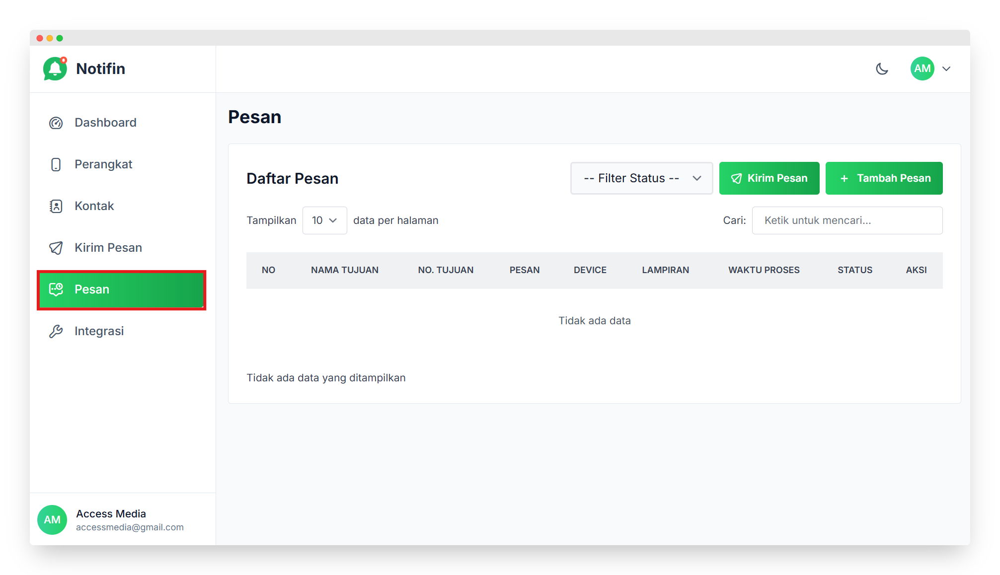
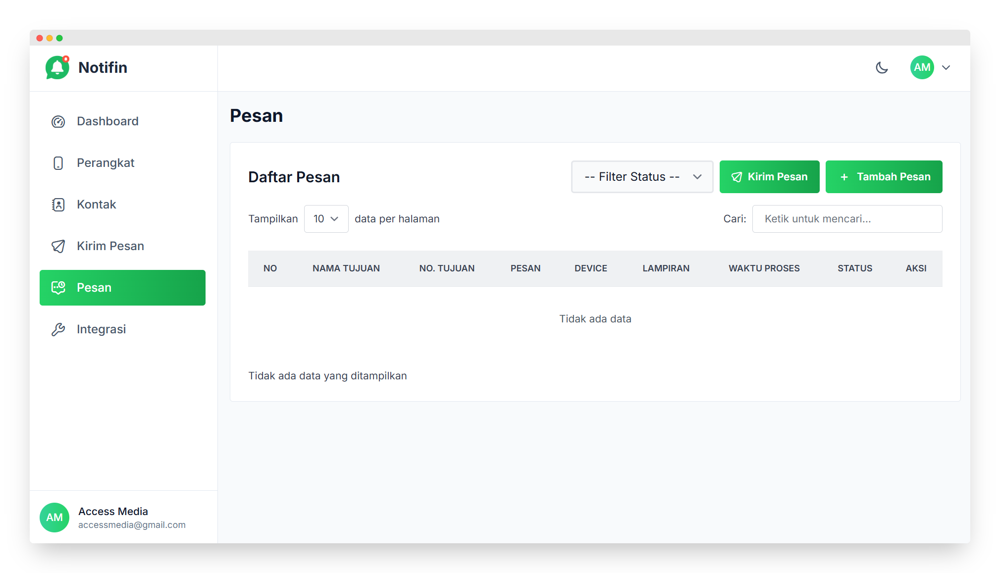
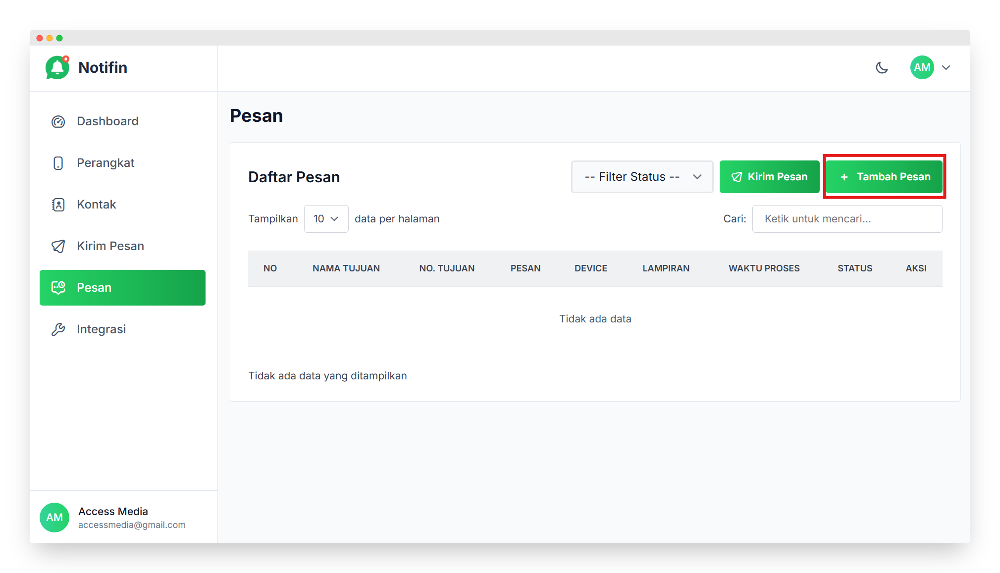
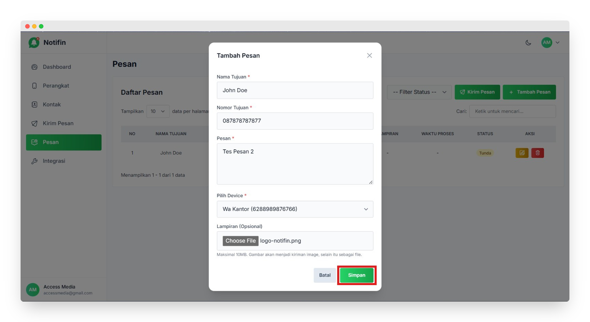
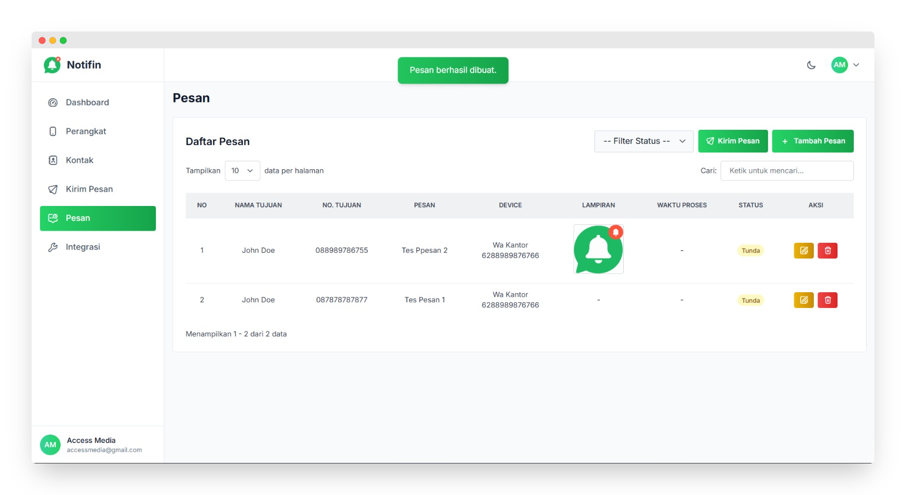
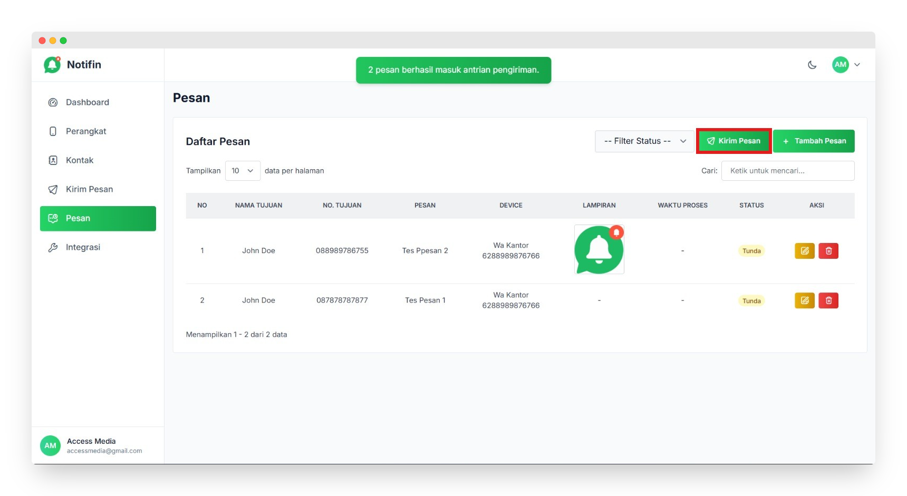
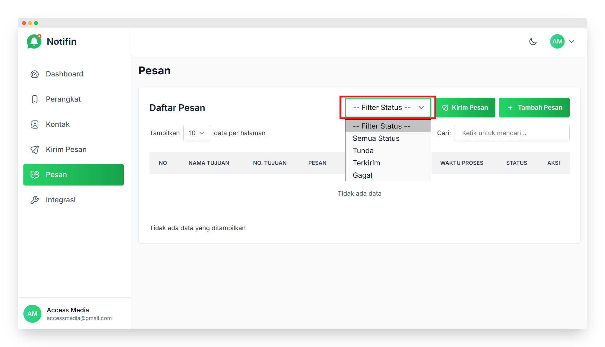
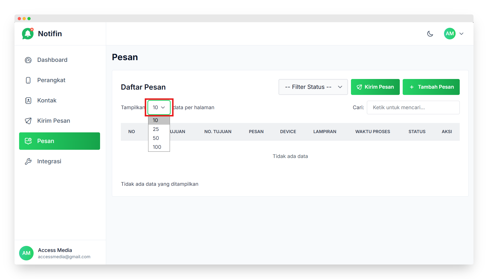
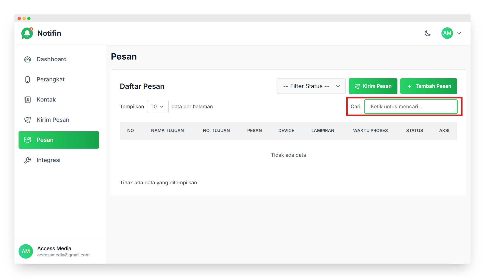

# Pesan

Panduan ini menjelaskan langkah-langkah untuk menggunakan fitur **Pesan** di aplikasi **Notifin**.

---

## Masuk ke Menu Pesan

- Di *sidebar* sebelah kiri, pilih menu **Pesan**.  
- Halaman ini menampilkan seluruh daftar pesan yang telah dibuat atau dikirim menggunakan perangkat yang sudah terhubung.

---

## Daftar Pesan

Pada halaman **Pesan**, ditampilkan tabel berisi informasi sebagai berikut:

> - **No** → nomor urut pesan.  
> - **Nama Tujuan** → nama penerima pesan.  
> - **No. Tujuan** → nomor telepon penerima.  
> - **Pesan** → isi pesan yang dikirim.  
> - **Device** → perangkat yang digunakan untuk mengirim pesan.  
> - **Lampiran** → file yang disertakan jika ada.  
> - **Waktu Proses** → waktu saat pesan dikirim atau diproses.  
> - **Status** → kondisi pesan berhasil, gagal, atau menunggu.  
> - **Aksi** → digunakan untuk melihat detail atau menghapus pesan.

---

## Tambah Pesan

- Klik tombol **Tambah Pesan** di kanan atas halaman untuk membuat pesan baru.

Isi form dengan data berikut:

1. **Nama Tujuan**  
   - Masukkan nama penerima pesan.

2. **Nomor Tujuan (WhatsApp)**  
   - Isi dengan nomor WhatsApp tujuan (contoh: *08...* atau *62...*).  

3. **Isi Pesan**  
   - Ketik pesan yang ingin dikirim ke penerima.  

4. **Pilih Device**  
   - Pilih perangkat WhatsApp yang digunakan untuk mengirim pesan.  

5. **Pilih Lampiran** *(opsional)*  
   - Tambahkan file jika diperlukan sebelum mengirim pesan.  

- Setelah semua data diisi, klik tombol **Simpan** untuk menambahkan pesan ke daftar.

---

## Mengirim Pesan

- Pilih pesan yang ingin dikirim dari daftar.  
- Klik tombol **Kirim Pesan**.  
- Pesan tidak langsung dikirim sekaligus, tetapi akan dimasukkan ke dalam **antrian pengiriman**.  
- Sistem akan mengirim pesan satu per satu setiap sepuluh detik secara berurutan.  
- Saat pesan berada dalam antrian, statusnya akan menjadi **Tunda**.  
- Setelah terkirim, status akan berubah menjadi **Terkirim**.  
- Jika gagal, status berubah menjadi **Gagal**.  
- Pastikan perangkat pengirim (**Device**) aktif dan terhubung agar antrian berjalan lancar.  

> Sistem antrian membantu menjaga kestabilan proses pengiriman, terutama saat mengirim banyak pesan sekaligus.

---

## Filter Status

Fitur **Filter Status** digunakan untuk menyaring pesan berdasarkan status pengirimannya.

Pilihan yang tersedia:

> - **Semua Status** → menampilkan seluruh pesan tanpa filter.  
> - **Tunda** → menampilkan pesan yang masih menunggu proses pengiriman.  
> - **Terkirim** → menampilkan pesan yang sudah berhasil dikirim.  
> - **Gagal** → menampilkan pesan yang gagal terkirim.

> Dengan fitur ini, pengguna dapat memantau status pengiriman dengan lebih cepat dan efisien.

---

## Tampilkan Data

Fitur **Tampilkan Data** memungkinkan pengguna menentukan jumlah baris yang ditampilkan pada tabel pesan.

Pilihan yang tersedia:

> - 10 data per halaman  
> - 25 data per halaman  
> - 50 data per halaman  
> - 100 data per halaman  

> Fitur ini membantu menyesuaikan tampilan agar lebih nyaman saat melihat daftar pesan dalam jumlah besar.

---

## Cari Pesan

Kolom **Cari** berfungsi untuk menemukan pesan tertentu secara cepat tanpa harus menggulir daftar.

Pengguna dapat mencari berdasarkan:

> - Nama tujuan  
> - Nomor tujuan  
> - Isi pesan  

> Cukup ketik kata kunci di kolom pencarian, sistem akan otomatis menampilkan hasil yang sesuai.

---

## Catatan

> - Hanya pengguna dengan akses tertentu yang dapat menambah atau mengirim pesan.  
> - Pastikan nomor tujuan sudah benar dan aktif agar pesan tidak gagal terkirim.  
> - Pesan yang sudah dikirim akan otomatis tersimpan di daftar pesan.  
> - Gunakan fitur **Cari** untuk menemukan pesan berdasarkan nama atau nomor tujuan.  
> - Fitur ini memudahkan pemantauan dan pengelolaan aktivitas pengiriman pesan secara efisien.

---

✅ **Selesai!** Pesan berhasil dibuat dan dapat dikirim melalui aplikasi Notifin 🎉
